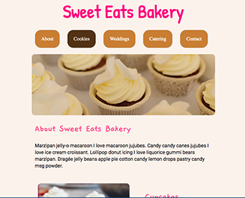
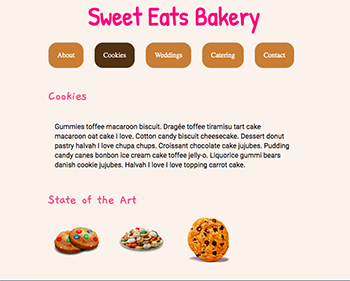

# Final Screenshots

Minimal Viable Project Tasks + Stretch Tasks   

 

# Links

<a href="http://jasheletillman.me/Sweet-Eats-User-Interface-Project/" target=_blank> See this project live? </a>

<a href="http://jasheletillman.me/Sweet-Eats-User-Interface-Project/cookies.html" target=_blank> Cookies Page </a>

# User-Interface---Sweet-Eats-Project
This project is going to explore selectors, inheritance in combination with our new found HTML skills.

# Tasks
Lets take our knowledge of CSS selectors, properties, and inheritance to add some style to the Sweet Eats Bakery website.  

<b>Task 1: </b>  
Fork this pen.  You will want to have your own version saved.

<b>Task 2:  </b>  
Explore the CSS.  Look at all the unique selectors.  Find things that are new to you and learn what they do.  Find properties you may not be familiar with and google them.

<b>Task 3:  </b>  
Update the CSS.  You will notice the CSS comments throughout the file below.  Follow the instructions to complete the Sweet Eats Bakery site.  If you follow the instructions, you should see this as a final result:

https://tk-assets.lambdaschool.com/44f6a520-b218-4ed1-910b-f4dc876cd1a6_sweet-eats-home-page.png

***DO NOT ATTEMPT STRETCH UNTIL YOU ARE FINISHED WITH EVERYTHING ELSE!***

<b>Stretch Task:  </b>  
Fork your final work and see how much you can change the design without changing the HTML.  Try to transform the site by only using CSS selectors.

<b>Stretch Task:  </b>  
Look at CSS animations and see if you could integrate them on the navigation hovers.

<b>Stretch Task:  </b>  
Pick a navigation item and create a new page with the same header and footer as the home page.  Example: you could make a new page just for cookies.  Be creative and have fun coming up with your own unique content and styles. 
